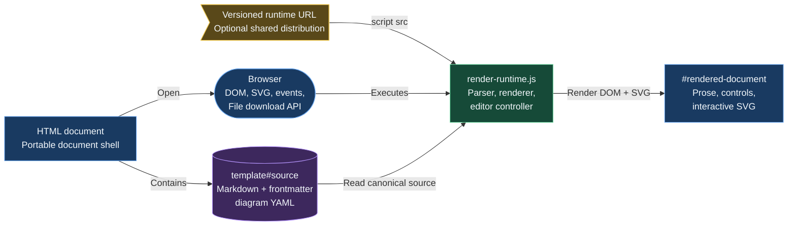
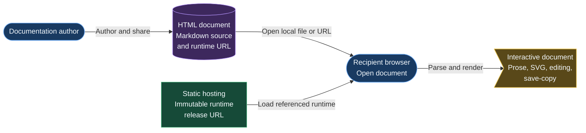

# DocDiagram renderer

DocDiagram is a browser-resident document format for technical documentation.
Each document is an ordinary HTML file containing Markdown in a `template#source`
element. A single JavaScript runtime converts that source into readable prose and
interactive SVG diagrams. The document remains portable: its complete editable
source travels with the HTML file, while the renderer can be supplied from a
centrally hosted, versioned script URL.

## System at a glance

The runtime has no server process, database, build step, or package dependency.
The browser loads the document and runtime, parses the source in memory, and
renders the result into `#rendered-document`. The source template is the
canonical state: editing a diagram serializes the changed model back into that
template, and Save a copy writes a complete new HTML document.



## Runtime modules and responsibilities

The application is implemented primarily in `render-runtime.js`, wrapped in
an IIFE so its internal state does not leak into a document page. A deliberately
small `DocDiagramCore` export exposes parsing, layout, serialization, and
mutation helpers for Node tests.

- Document bootstrap finds `#source` and `#rendered-document`, injects page styles, captures the saved source, and initiates rendering.
- Document parsing reads optional YAML frontmatter and accepts the `light` or `dark` theme. The selected theme styles both the surrounding document and diagram defaults.
- Markdown rendering intentionally supports a compact subset: headings, paragraphs, unordered lists, ordinary fenced code blocks, and fenced `diagram` blocks.
- Diagram parsing accepts a restricted YAML structure with a canvas, nodes, and edges. Validation requires every node to declare a supported shape and every edge to declare source and target anchors.
- SVG rendering resolves node palettes and optional per-item style overrides, builds shape geometry and anchors, draws edge routes and markers, and renders multiline labels as centred `tspan` elements.
- Edit orchestration owns selection, drag and resize behavior, inline text editing, connector creation/reconnection, the inspector, zoom, and source persistence.

```mermaid
flowchart LR
  template[(Source template<br/>Markdown document)]
  frontmatter[Frontmatter resolver<br/>theme + content]
  markdown[Markdown renderer<br/>HTML prose + fences]
  parser[Diagram parser<br/>Restricted YAML<br/>schema validation]
  model[(Diagram model<br/>canvas, nodes, edges)]
  svg([SVG renderer<br/>geometry, routes,<br/>markers, labels])
  dom[Rendered DOM<br/>Styled prose and<br/>diagram figures]

  template -->|Document text| frontmatter
  frontmatter -->|Content + theme| markdown
  markdown -->|diagram fence| parser
  parser -->|Validated model| model
  model -->|Layout input| svg
  svg -->|SVG markup| dom
  markdown -->|Prose markup| dom

  classDef application fill:#193A61,stroke:#71AEF7,color:#F3F8FC
  classDef service fill:#164A38,stroke:#66D39A,color:#F3F8FC
  classDef datastore fill:#3D285D,stroke:#B796FF,color:#F3F8FC
  class template,model datastore
  class frontmatter,markdown,parser,svg service
  class dom application
```



## Document and diagram source format

The document frontmatter is optional. When present, it must be the first
non-empty content and use `---` delimiters. Its `theme` property is resolved
before the Markdown body is rendered. A diagram is a fenced code block whose
language is exactly `diagram`.

````markdown
---
theme: dark
---

# A technical document

```diagram
type: flowchart
version: 1
canvas:
  width: 800
  height: 500
nodes:
  - id: api
    label: API
    shape: rounded-rectangle
    position: { x: 100, y: 100 }
    size: { width: 190, height: 80 }
edges:
```
````

Each node has an identifier, label, shape, position, and size. A node may select
a `palette` with a `tone` and `colour`, or use explicit style overrides.
Supported shapes include rounded rectangles, circles, ovals, databases,
diamonds, rhombuses, flattened hexagons, chevrons, and right chevrons.

Edges identify source and target nodes and explicitly choose one of the four
anchor sides: `top`, `right`, `bottom`, or `left`. They may use `orthogonal`,
`straight`, or `curved` routing. Endpoint markers independently support
`none`, `arrow`, and `circle`; the default is no start marker and an arrow at
the end. Canvas grid snapping is opt-in through a positive `canvas.grid`.

## Editing and persistence flow

View mode presents compact zoom, fit, and edit controls. Entering edit mode
captures an edit-session snapshot. Users can select nodes and edges, drag and
resize nodes, use exposed connection ports to create or reconnect edges, and
change labels directly or through the inspector. Inspector changes mutate the
in-memory diagram model, serialize all diagram blocks, and update the source
template before rerendering.

The Done action retains the updated source. Cancel restores the captured
session source, discarding all edits made since edit mode started. Save a copy
creates a browser download containing the current full HTML file, including the
canonical source rather than only rendered output.

```mermaid
flowchart LR
  reader([Reader])
  controls[View / edit controls<br/>Enter edit mode]
  interaction[Canvas interaction<br/>select, drag, resize,<br/>edit, connect]
  model[(In-memory model<br/>diagramModels[])]
  serializer[YAML serializer<br/>Escapes multiline<br/>scalars safely]
  source[(Source template<br/>Canonical state)]
  save>Save a copy<br/>Downloaded HTML]

  reader -->|Choose Edit| controls
  controls -->|Bind edit events| interaction
  interaction -->|Apply mutation| model
  model -->|Persist model| serializer
  serializer -->|Rewrite diagram fence| source
  source -->|Rerender| interaction
  source -->|Complete HTML source| save

  classDef application fill:#193A61,stroke:#71AEF7,color:#F3F8FC
  classDef service fill:#164A38,stroke:#66D39A,color:#F3F8FC
  classDef datastore fill:#3D285D,stroke:#B796FF,color:#F3F8FC
  classDef note fill:#594819,stroke:#F1CC58,color:#F3F8FC
  class reader,controls application
  class interaction,serializer service
  class model,source datastore
  class save note
```

## Rendering invariants and safeguards

The runtime treats the source template as the authority and does not introduce
a competing persisted model. It escapes Markdown text and user-visible SVG
text before producing markup. Diagram parsing rejects unsupported sections,
shapes, routes, anchors, and style-width aliases rather than guessing at their
meaning. Edge marker definitions are scoped by diagram and edge index, so a
per-edge stroke override cannot affect another connector's marker.

Geometry is calculated from a node's shape, bounds, and anchor side. Moving a
node outside the canvas expands the canvas with padding; moving it into a
negative position shifts every node back into positive coordinates. Resizing
enforces minimum node dimensions and optionally aligns dimensions and positions
to the canvas grid.

## Distribution model

For local development, a document may reference a local `file://` runtime URL.
That is convenient but machine-specific. For portable sharing, point the script
tag at an immutable hosted version of `render-runtime.js`. The downloaded
HTML then carries its Markdown and diagram source while retrieving a known
renderer implementation when opened.



## Verification

The project includes a Node test suite that executes the runtime in a VM-like
document context and tests the exported core behavior. Coverage includes
frontmatter resolution, validation, geometry helpers, grids, model mutation,
YAML serialization and multiline round trips, themes and styles, SVG markup,
and per-edge marker isolation. Run the targeted suite with:

```sh
node --test test/render-runtime.test.js
```

For a browser validation, open this document or `example.html`, confirm that
each diagram renders, enter edit mode, change a node label and an edge property,
then use Save a copy and reopen the downloaded document. The changed diagram
source should still be present and render identically.
